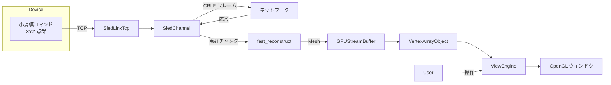

# プロジェクト全体 ― 概要ドキュメント（日本語版）

本リポジトリは 通信系（SledChannel スタック）と 可視化系（One-Shot 3D ビジュアライザー）を束ね、  
「デバイス → TCP → 点群再構築 → GPU 描画」を **数十 ms レイテンシ** で完結させることを目的に設計されています。

---

## 🧱 1. レイヤ構成

| レイヤ             | 主要コンポーネント                   | 役割                                               | 主なデータ |
|--------------------|--------------------------------------|----------------------------------------------------|------------|
| ネットワーク I/O    | `SledLinkTcp`                        | IPv4/IPv6 デュアルスタック・NoDelay / Keep-Alive 最適化 | TCP バイトストリーム |
| 通信チャネル        | `KvAsciiCodec`, `SledChannel`        | CR/LF テキストフレーム化、ゼロコピー解析、送受信協調ループ、`_maxInFlight` 制御 | ASCII／Shift-JIS フレーム |
| サーバテスト桩     | `TcpServer`                          | HELLO/BYE 認証、RD コマンド模擬、負荷テスト         | 擬似応答 |
| 点群再構築         | `fast_reconstruct (C++)`             | CGAL／Subdiv2D Delaunay、OpenMP+SIMD 法線合算、LUT 彩色 | 点群 ↔ メッシュ |
| マネージド橋渡し   | `CaptureTrataits (P/Invoke)`         | ゼロコピーで Mesh 構造体を .NET へ                 | Mesh 構造体 |
| GPU リソース       | `GPUStreamBuffer / VertexArrayObject`| 永続マップ RingBuffer、VAO 自動レイアウト           | VBO・EBO |
| 描画パイプライン    | `ViewEngine / Shader`                | 視錐台カリング、sRGB+MSAA、GLSL ホットスワップ      | OpenGL ドロー |
| ユーザ操作         | `GLInteractor`                       | オービット・パン・ズーム・リセット                 | 入力イベント |

---

## 🔁 2. エンドツーエンド データフロー

### 通信（B → C → D）

- 送信は `Channel.Writer` へ集約し、一括 `WriteAsync`
- 受信は `PipeReader` + `SequenceReader.TryReadTo` で `\r\n` 区切りゼロコピー解析
- `_maxInFlight` ウィンドウで同時リクエストを制限し、順序保証

### 再構築（E）

- CGAL Delaunay 標準：30k 点 ≈ 32 ms  
- LUT 彩色 + OpenMP 法線合算：≈ 2 ms

### 描画（F → G → H）

- 永続マップ RingBuffer で転送コスト最小化
- VAO 反射キャッシュが属性を自動設定
- GLSL 保存後 1 フレームでホットリロード、Frustum カリングで無駄な draw 削減

---

## ✨ 3. 技術ハイライト

| カテゴリ   | ハイライト                                      | 効果                    |
|------------|------------------------------------------------|-------------------------|
| 通信       | 単スレッド Send/Recv 協調ループ & ゼロコピー解析 | 千 QPS でも CPU < 1 %   |
| 整合性     | `TaskCompletionSource` FIFO マッチング         | 高並列でも応答乱序ゼロ |
| 再構築     | CGAL + SIMD/OpenMP、OpenCV へフォールバック可     | 依存柔軟・速度最適     |
| 描画       | 永続マップ Buffer & GLSL Hot-swap              | デバッグ即時反映 + 高 FPS |
| テスト     | 軽量 `TcpServer` 桩                            | CI で負荷/例外シナリオ実行 |

---

## 🗺 4. ロードマップ

| マイルストーン             | 状態     | 詳細                     |
|---------------------------|----------|--------------------------|
| M1 通信栈安定化            | ✅ 完了  | 13 万リクエスト耐久テスト通過 |
| M2 再構築 32 ms            | ✅ 完了  | CGAL 化で 82 → 32 ms     |
| M3 GLSL Hot-reload         | ✅ 完了  | 1 フレーム再リンク       |
| M4 Meshlet / GPU カリング  | 🔄 進行中 | 描画性能 2× 目標         |
| M5 macOS 対応              | 🕒 計画  | Metal バックエンド追加   |

---

## 🎯 5. ワンフレーズまとめ

**SledChannel** がコマンド往復を絶対に取り違えず届け、  
**One-Shot 3D ビジュアライザー** が数十ミリ秒で点群をメッシュ化して描画。  
ふたつを組み合わせれば、最小限のコードで「デバイス → 可視化」をワンストップ実装できます。
